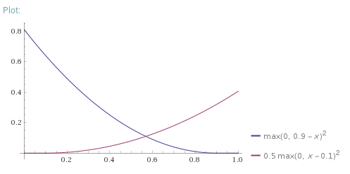
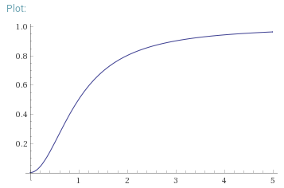

### Introduction

In this section I'll briefly describe the intuition behind capsule networks. I learned this from the original paper[^2] and a video by Aurélien Géron[^1] 

##### Motivation and description of capsules

The motivating idea behind capsule networks is that objects are made of parts. Every object is made of sub-objects, so representing an object only requires storing which sub-objects it contains, and each of their relative positions to the original object. The relative position (and some other variables determining how the object looks, e.g. line thickness) is referred to as the "pose" of the object. [^1] Capsule nets represent objects in this way by having each capsule represent an object, with lower layers of capsules representing sub-objects, and higher layer capsules representing objects which are combinations of lower level objects. Each capsule is a vector, where the length of the vector represents the certainty that that capsules object is in the image, and the direction of the vector represents the pose of the object.

##### Routing by agreement + intuition

Routing by agreement is an algorithm for connecting one layer of capsules to another layer. The algorithm must correctly identify which sub-objects go together to form an object, and connect the capsules representing the sub-objects to the object capsule in the next layer. It does this by having every sub-object capsule predict the pose of each object in the next layer. If several sub-objects agree on the pose of an object, it's very likely that the object is made up of those sub-objects. The algorithm identifies sub-objects that agree with each other using an iterative procedure kind of similar to k-means. This can also be thought of as finding the hypothesis that best explains the position of all the sub-objects. 

##### The loss

The total loss is the sum of the loss of each output capsule $k$, which is calculated with: $L_k = T_k max(0,0.9-||v_k||)^2 + 0.5 (1-T_k) max(0,||v_k|| - 0.1)^2$ where $T_k \in \{0,1\}$ is the label and $v_k$ is each output capsule. This is a margin maximising loss function, which was probably chosen to improve generalisation. Rosset, Zhu and Hastie[^6] showed that loss functions of this form converge to margin maximizing separators.



In the final layer of capsules, each of the 10 capsules represents a digit. The vector norm of each capsule represents the likelihood of a digit being present. The loss function used can be seen above, with $x$ being the norm of one of the output capsules, and $y$ being the loss. The blue line is the penalty if this digit is actually present in the image, and the red line is the penalty if it is not.

A reconstruction loss is added to the margin loss above to make sure each capsule retains as much information as possible about the digit it represents. As well as providing regularisation, this addition to the loss allows the researchers to examine how the pose is represented in each capsule.

### Implementation

I attempted to copy the original implementation architecture as closely as possible. The main differences I can think of are weight initialisation (which wasn't specified in the paper), and the size of the training set.

##### Eager Execution

I chose to use Eager Execution mode in TensorFlow to implement this model. This mode makes TensorFlow more similar to PyTorch, and is a little more intuitive to use than graph mode. Loops in tensor calculations are more straightforward in eager execution, and routing by agreement contains a loop. I don't know of any CapsuleNet implementations made using eager execution mode.

##### Implementing Layers as objects

I decided to break the algorithm up into layers, as is often done in TensorFlow. This way it's easier to reuse each component of the algorithm in a different architecture.

Initially I planned to implement each layer as a function, and have all weight variables held in a global dictionary. This seemed inelegant, so I decided to imitate the TensorFlow Layer classes, and implement each layer as an object which stored it's own variables. This created the problem of collecting all the trainable variables into one list when they needed updating, but that wasn't too difficult to solve. 

In my first implementation, I created the weight variables upon initialisation of each layer object. Eventually I figured out it was easier to initialise layer variables during the first execution of the layer, because that way you don't have to know the input and output shape of each layer in advance. I learnt a lot about keras Layer objects by trying to imitate them in my implementation.

##### Vectorising the algorithm

The thing I learned most about during this project was translating the algorithm from the description in the paper to a vectorised implementation that runs efficiently. I spent roughly two days figuring out the shapes of tensors and weights at every level of the network, and which tensorflow operations should be used. For calculating the 'votes' during routing by agreement, I used the ```tf.einsum()``` function, which is a very general approach to tensor operations that involve multiplying and summing, like matrix multiplication.

##### Death by NaN

One problem I've encountered several times in the past, but still had trouble with in this project, is making sure every calculation has a well defined gradient and no divide by zero errors. When implementing the squash function and the loss, I used the built in ```tf.linalg.norm(x)``` function, for which the gradient isn't defined when the norm of ```x``` is 0. This caused a bug that was difficult to trace, because the network would work fine for a while, then at a random time, the loss would become NaN and never recover. To fix it, I used a safe approximation to the norm: ```tf.linalge.norm(x+1e-7)```, so that the gradient is always well defined.



Above is a graph of the squash function used in capsule networks, which squashes the norm of capsules (x-axis) down to a value between 0 and 1 (y-axis). It is defined as $\frac{||\bold{x}||^2}{1+||\bold{x}||^2}\frac{\bold{x}}{||\bold{x}||}$. It's clear that this function requires a safe approximation to the norm.

##### Initialisation problems

In the past I've always found very very small random values to be best for weight initialisation. However, when testing, I found that very small initialisation values caused a very low learning rate. This is probably due to very small gradients when  the norm is near 0 in the squash function, as can be seen above.

##### Why do they apply ReLU before squashing the first layer of capsules?

For some reason, all implementations of capsule networks I found (including the original implementation) did a curious thing that was not explained in the paper. They all applied a ReLU activation function before the squash function on the first layer of capsules. Applying one activation function directly after the other doesn't seem necessary.  I tested both ways, and found no significant difference between them. I decided not to use the unnecessary ReLU in the final version.

### Results of Experimentation

Before doing any experimentation I split the normal training set, which is usually 60,000 images, into a training set of 50,000 and a validation set of 10,000. I used performance on the validation to debug the algorithm and adjust hyperparameters (like weight initialisation), and only tested it on the test set at the very end of the project.

I ran tests in Google Colab, which can be found and run online [here](https://colab.research.google.com/drive/1XdPeFbq9ufvS3XZYmYUi2nVzmJ-8cPYZ)[^5]. To speed things up, go to ```Edit -> Notebook Settings``` and set the hardware accelerator to GPU. Impressively, even after one epoch the network gets 98.38% validation accuracy. After training for 10 epochs, this network achieves 99.31% test accuracy. The paper reports getting 99.75%. Given I used the same architecture, I think the difference comes from the reduced training set size and less training.

To download the project from Dropbox, including a pre-trained model, go to https://www.dropbox.com/sh/v7hm3cx5fo9nv1d/AAAfkarwuJh-UHauWxu5DHTva?dl=0

##### Experimenting with the loss

I found the margin loss to be the part of the algorithm that seemed the most arbitrary, so I experimented with small variations to see what would happen. This was all tested on the validation set.

The original loss (more detail above) is: $L_k = T_k max(0,0.9-||v_k||)^2 + 0.5(1-T_k) max(0,||v_k|| - 0.1)^2$ 

When I took away the square, the loss became:

$L_k = T_k max(0,0.9-||v_k||) + 0.5 (1-T_k) max(0,||v_k|| - 0.1)$

This reduced the validation accuracy to ~98.5%.

When I tried adjusting the 0.9 and 0.1 values to 1 and 0 respectively, the validation accuracy went down to ~98.9%. 

After some searching, I'm still not sure how this exact form of the loss was chosen. Probably there was very little theoretical justification, and it was found by empirical tests. I think small decisions like this should have been explained in more detail in the paper.

### References

[^1]: "Capsule Networks (CapsNets) – Tutorial" video by Aurélien Géron. [Link](https://www.youtube.com/watch?v=pPN8d0E3900)
[^2]: Sabour, S., Frosst, N. and Hinton, G.E., 2017. Dynamic routing between capsules. In *Advances in neural information processing systems* (pp. 3856-3866).
[^3]: Original capsule paper
[^4]: Capsule autoencoders?
[^5]: https://colab.research.google.com/drive/1XdPeFbq9ufvS3XZYmYUi2nVzmJ-8cPYZ
[^6]:Rosset, S., Zhu, J. and Hastie, T.J., 2004. Margin maximizing loss functions. In *Advances in neural information processing systems* (pp. 1237-1244). [Link](https://papers.nips.cc/paper/2433-margin-maximizing-loss-functions.pdf)